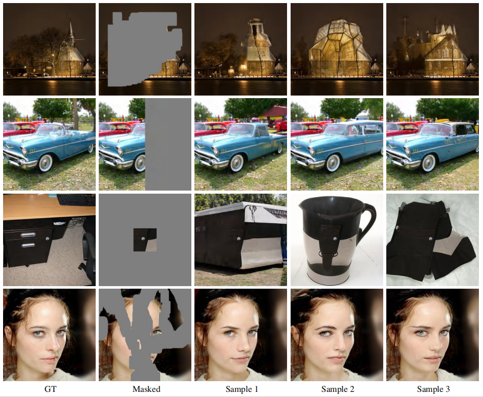

# MAD-paint: Mask-Aware Diffusion Sampling for Image Inpainting

This is the official impelmenation of the paper MAD-paint: Mask-Aware Diffusion Sampling for Image Inpainting.



## Abstract
Image inpainting aims to repair digital images with defects such as holes and scratches at both semantic and textural levels. Diffusion models have shown great success in image inpainting, delivering high-quality results. However, existing diffusion-based methods often overlook the shape of defective regions/masks, applying a uniform sampling strategy across varying shapes. This oversight may lead to low-quality or semantically inappropriate restored images. In this paper, we propose MAD-paint (Mask-Aware Diffusion sampling for inpainting), and show that applying different noise types tailored to specific defect regions/mask shapes during the reverse diffusion process can significantly improve the inpainting quality. We begin by introducing a metric for mask uncertainty to assess the impact of different masks on inpainting quality. Using this metric, we propose a mask-aware sampling approach that automatically adjusts its sampling strategy according to different mask shapes, as indicated by the mask uncertainty. In addition, leveraging the known image texture consistency, we propose a known region-guided iterative refinement mechanism to condition texture restoration. The experimental results demonstrate the advantages of our method over other diffusion-based inpainting methods.
## Setups
### Install our code by running
```
git clone 
```
### Build environment by running
```
conda env create -f environment.yml
```
### Download pretrained models (provided by [OpenAI](https://github.com/openai/guided-diffusion) and [Repaint](https://github.com/andreas128/RePaint)) and test data
```
bash download
```


## Usage
### Inpainting with `MAT-paint`
To test on CelebAHQ and ImageNet, you can run
```
bash madpaint
```
To inpaint your own images, you can put your images under datasets/examples, and masks under datasets/mask/examples, then run
```
python main.py --config_file configs/examples.yaml
```

You can also make your own config under configs/.

Here are some parameters to help you make your own config and test your data:
- `dataset_path`: Path to the folder with images requiring inpainting. If left empty, the CelebAHQ or ImageNet dataset will be automatically selected  based on dataset_name.
- `mask_type`: Path to the folder with masks to be applied to inpainting images.
- `outdir`: Path to the folder which is used to save output images.
- `madpaint.a, madpaint.k, madpaint.p, madpaint.max`'`: Parameters described in paper

## References
This implementation is based on:
* https://github.com/andreas128/RePaint
* https://github.com/UCSB-NLP-Chang/CoPaint